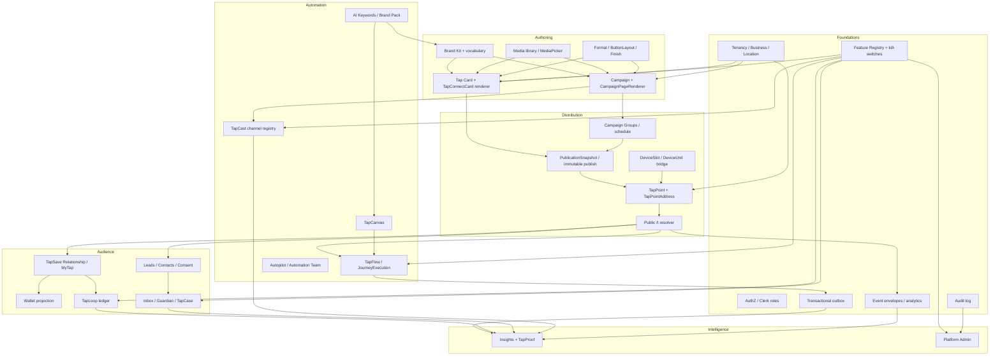

# Product Dependency Map — TapConnect Fusion

**HEAD:** `9965c8a` · **Branch:** `tapconnect-v1-v2-fusion` · **Date:** 2026-07-24  
**Purpose:** Authoritative shared-system dependencies. Prefer reuse over parallel islands (directive §8).

---

## 1. Spine graph (authoritative owners)

---

## 2. Shared contracts (do not fork)

| Contract | Owner | Consumers | Notes |
|----------|-------|-----------|-------|
| Feature resolve + kill-switch | `lib/fusion/features` | All gated pillars | 503 `feature_off` standard |
| Display readiness | `lib/fusion/readiness/display-status.ts` | Studio badges | Never static OWNER-READY |
| Studio IA | `lib/fusion/studio/ia.ts` | Nav, Create, search | TikTok **inside** TapCast |
| Campaign content blocks | `lib/services/normalize-content-blocks.ts` + renderer | Workbench, public `/t` | One renderer path |
| Card sections | `lib/brand/tap-card.ts` + `TapConnectCard` | Builder, MyTap Keep, public | One renderer path |
| Button layout attrs | `ButtonLayoutControls` + CSS | Campaign `.tap-btn`, Card `.tcc-pill` | Parity proved |
| Media / bg-remove | `MediaPicker`, `lib/media/bg-remove` | Builders | local-mock default |
| Brand vocabulary | `BrandVocabularyTerm` + `/api/ai/keywords` | Brand Kit, Canvas bind | Gate `ai.keywords` |
| TapPoint address | `TapPoint` / `TapPointAddress` | Devices, public | Permanent opaque |
| Publication | `PublicationSnapshot` | Resolver | Immutable publish intent |
| Device bridge | `lib/fusion/devices/tap-point-bridge.ts` | Devices ↔ TapPoint | Migration dual model |
| Relationship | TapSave / MyTap token | Wallet, Moments, loyalty display | No PII in URLs |
| Loyalty ledger | `/api/loyalty/*` | Audience, Insights | Append-only |
| Journey execution | `JourneyPublishedVersion` / `JourneyExecution` | Public tap, Insights | Mock provider effects |
| TapCast registry | `lib/fusion/tapcast/registry` | TapCast UI, Admin health | TikTok nested |
| Inbox / Guardian | Inbox APIs + Guardian | Audience, productivity ExternalWorkItem | Deterministic Guardian |
| Outbox | Fusion outbox | TapFlow, Admin recovery | Retries / dead-letter |
| ExternalWorkItem | Productivity connectors | Inbox cases | Canonical external work |
| Kill-switch matrix | `kill-switch-matrix.ts` | Admin + e2e | Expanded matrix proved |

---

## 3. Dependency direction rules

1. **Campaign owns initiative; Distribution is a mode** — do not invent a second campaign browser inside TapCast.  
2. **Card is living mobile channel; MyTap/Wallet are projections** — do not create competing identity.  
3. **Tap Point address never rewritten for content changes** — publish/assign, don’t mutate address.  
4. **TapSave owns relationship; consent is channel-specific.**  
5. **Channel Guardian is deterministic** — never AI-decided.  
6. **TikTok is first-class inside TapCast** — not a permanent Experiences sibling; do not overweight vs foundations.  
7. **Keywords store lives under Brand Kit** — Canvas/Flow bind via shared gate `ai.keywords`.  
8. **Live providers** — mock adapters first; classify live as VERIFIED — CREDENTIALS REQUIRED.

---

## 4. Journey → shared systems completed

| Journey family (see inventory) | Completes / hardens |
|--------------------------------|---------------------|
| J1 First public Tap | Brand, Card/Campaign, Format, Media, Groups, Pub, TapPoint, Public, Leads, Events, Insights baseline, Features honesty |
| J2 Brand → reusable output | Brand Kit, media lifecycle, vocabulary, rights/provenance |
| J3 Card retention | Card, TapSave, MyTap, Moments, Wallet mock, consent |
| J4 Campaign schedule/report | Campaign, Groups, resolver, Insights campaign view |
| J5 Device fleet | Devices, TapPoint, Scan, Sets/Rotations, Pulse |
| J6 Conversation service | Inbox, Guardian, TapCase, ExternalWorkItem, audit |
| J7 Loyalty | TapLoop, evidence, Insights loyalty, Wallet touch |
| J8 Commerce | TapCommerce, loyalty hook, Insights commerce |
| J9 Canvas/Flow | TapCanvas, TapFlow, Keywords bind, outbox, monitoring |
| J10 Team/facility | Tenancy, membership, scoped assets/providers, audit |
| J11 Provider connect | Integrations, Admin health, reconnect, audit |
| J12 TapCast distribute | TapCast registry, variants, (later live OAuth) |

---

## 5. Credential-gated dependency islands

Do **not** block foundation journeys on these:

| Island | Feature / env | Local substitute |
|--------|---------------|------------------|
| TapCast live publish | `TIKTOK_*`, Meta, X, … | Mock registry / ladder |
| Messaging live | `META_*`, Twilio, … | Inbox mock |
| Wallet live | Apple/Google certs | Mock wallet |
| AI enhance / trends | `OPENAI_*`, trend vendor | Grounded Keywords; Autopilot mock |
| Stock search | Pexels/Unsplash/Logo.dev | Upload / local library |
| Bg-remove live vendor | Vendor key | `local-mock` adapter |
| Stripe | `sk_test_` / live | Commerce mock + readiness UI |
| Productivity OAuth | monday/Asana/Slack/… | Mock closeout 18/18 |
| Email live | Resend + DNS | Email mock |

---

## 6. Conflict / duplication watchlist

| Risk | Status | Action |
|------|--------|--------|
| DeviceSlot vs DeviceUnit vs TapPoint | Bridge present; dual vocabulary | Prefer TapPoint address as public truth; migrate carefully |
| Static IA `maturity: owner_ready` vs ledger | Resolved via `resolveSectionReadiness` | Never trust static maturity alone |
| TikTok as sibling product | Locked nested under TapCast | Keep IA rule |
| Parallel AI / Keywords stores | Brand vocabulary + `ai.keywords` | No second keyword DB |
| Analytics V1 `/dashboard/analytics` vs Insights hub | Both present | Insights authoritative; V1 alias preserved |
| Whiteboard legacy vs TapCanvas | Legacy points at workbench | Prefer TapCanvas |

---

## 7. Admin governance dependencies

Every gated pillar must remain controllable via Feature Registry without UI redesign:

`comms.*` · `wallet.apple_google` · `loyalty.taploop` · `commerce.tapcommerce` · `journey.tapflow` · `canvas.tapcanvas` · `ai.autopilot` · `ai.keywords` · `brand.vocabulary` · `tapcast.*` · `connectors.productivity` · `integrations.live_execution` · `card.builder.freeform` · `ops.pulse` · `billing.stripe`

Kill-switch off → API **503** `{ code: feature_off }` (proved for expanded matrix).

---

## Related

`PRODUCT_TRUTH_MAP.md` · `VERTICAL_JOURNEY_INVENTORY.md` · `COST_CONSCIOUS_IMPLEMENTATION_SEQUENCE.md`
