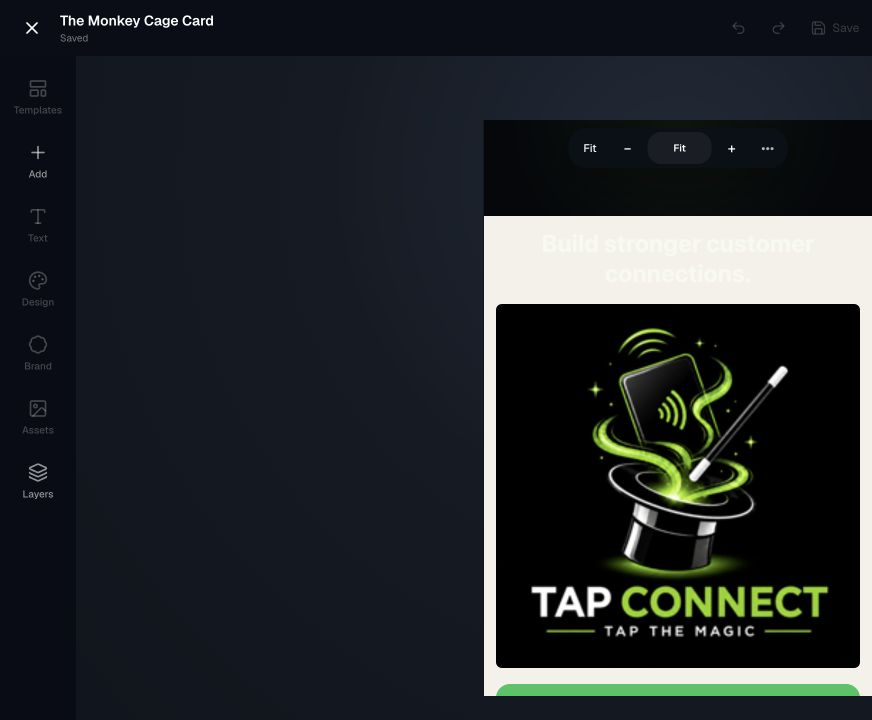
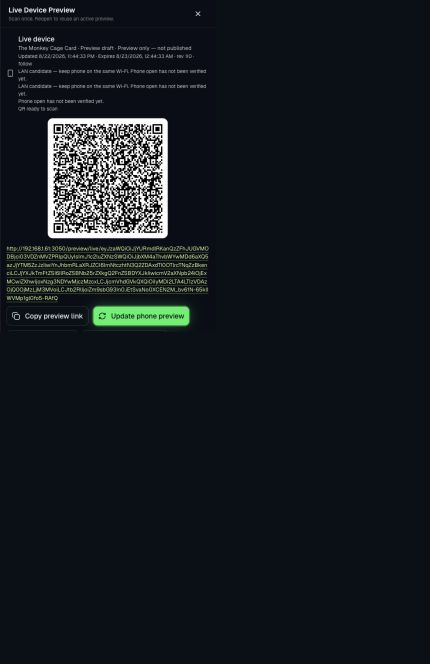
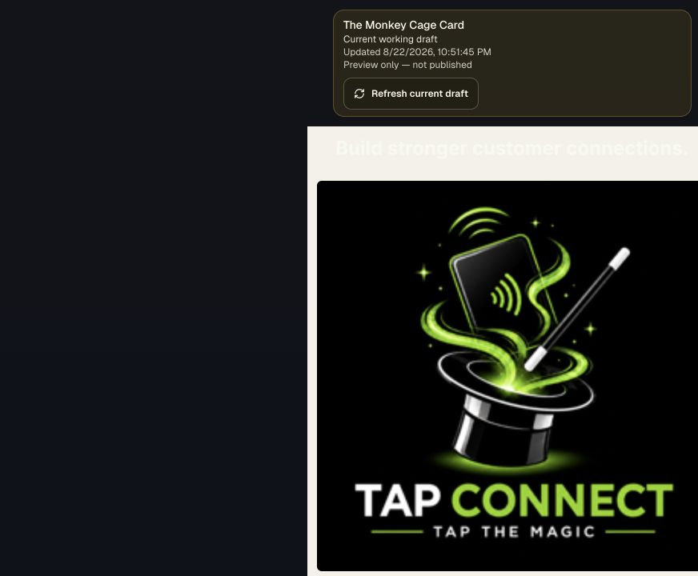

# Live Device + phone viewport correction proof

Review entry: `http://127.0.0.1:3050/review/studio`

## Running-browser measurements

| Surface | Viewport authority | Card width | Composition width | Vertical overflow |
| --- | ---: | ---: | ---: | ---: |
| Studio phone Device View | 390 px | 388 px | 388 px | 1,631 px content / 576 px visible |
| Live Device route in desktop review window | 512 px desktop review cap | 512 px | 512 px | 1,528 px document / 720 px visible |
| Live Device at the 390 px phone acceptance viewport | 390 px contract | 390 px asserted | 390 px asserted | full document scroll asserted |

The two-pixel Studio difference is the desktop editor's vertical-scrollbar allocation inside the 390 px review column. It is not Card padding and does not exist in the 390 px runtime contract. The Card shell and composition share the same measured width in each runtime.

## Session lifecycle proof

- Closing and reopening Live Device retained the exact same valid signed URL.
- **Generate new QR** returned a different signed URL.
- Reloading the prior URL returned `This preview was revoked`.
- The replacement URL opened the intended current Card directly without Clerk cookies or navigation.
- The QR URL used the active LAN host and port, not `localhost`.

## Screenshots

| Studio phone Device View | QR reopened on demand | Signed Live Device route |
| --- | --- | --- |
|  |  |  |

Physical-iPhone parity remains Product Owner verification. These artifacts do not claim physical-device verification.
